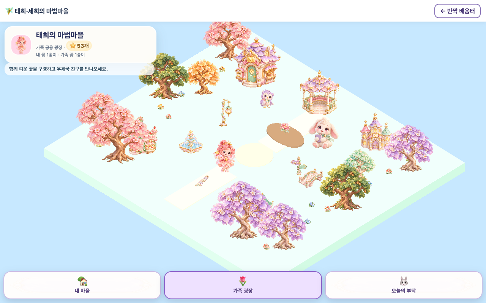

# 실제 개별 에셋 적용 및 실행 검증 · v0.3.1

62개 독립 RGBA PNG를 실제 마을·학습·보상 UI에 연결했습니다. Unity 런타임에서 실제 개별 프리팹 46종(World43·캐릭터2·완료 꽃1)의 생성 로그를 확인했고, 브라우저 UI에서 원본 PNG19종(캐릭터2·보상14·UI3)이 모두 로드되는 것을 확인했습니다. 캐릭터2와 완료 꽃1의 중복을 제외하면 고유 에셋62종입니다.

이번 작업은 기존 고품질 개별 PNG의 실제 사용 경로를 완성한 것입니다. PNG62개의 원본 바이트·해시는 유지했습니다. 마을에서 빠졌던 환경 에셋17종을 추가 배치하고, 이미지로 새 GameObject를 만드는 경로를 작성된 프리팹을 Instantiate하는 경로로 교체했습니다. 모두 3D 지형 위에 놓이는 2.5D 스프라이트입니다.

| 구분 | 수 | 실제 적용 위치 |
|---|---:|---|
| 태희·세희 | 2 | 선택된 아이의 Unity 아바타, 학습 도우미 및 프로필 UI |
| 건물·나무·꽃밭·NPC·소품 | 43 | 내 마을28종·가족 광장22종, 공통7종 |
| 별·성장 단계·배지·선물 | 14 | 과목별 별, 확인한 답 수에 따른 seed/sprout/bud/bloom, 실제 획득 배지·선물 UI; bloom은 완료 정원에도 사용 |
| UI 장식·패널 | 3 | 실제 문제/해설 패널·별 표시·클릭 버튼 |
| 합계 | 62 | 작성된 Unity 프리팹62개와 전체 검토 씬도 제공 |

선물 카탈로그48종은 기존 가격·구매·장착 규칙을 유지합니다. 카탈로그의 모든 선물에 새 전용 PNG를 만든 것은 아니며, 승인된 보상14종을 해당 별·배지·가족 활동·진행 UI에 연결했습니다. 잠긴 배지는 seed로 표시하고, 실제 조건을 충족한 배지만 획득 아트로 바뀝니다.

## 실행 결과

검증 대상은 Mac 로컬 개발본 `http://127.0.0.1:4179/`입니다. 격리된 가상 학습 기록으로 Chrome에서 실제 WebGL을 실행했습니다.

| 검사 | 최종 결과 | 확인 내용 |
|---|---|---|
| Unity 6000.3.26f1 최종 WebGL | exit0 / v0.3.1 | 실제 프리팹62개 연결, World43종, 기존 검토 씬과 Editor 상태 보존 |
| 실제 WebGL 흐름 | 11/11 통과 | 태희5문항·세희3문항, 별·꽃, 아이별 분리, 광장 전환, 새로고침 후 중복 지급 방지, 실제 프리팹46종 사용 |
| 마을 DOM 입력·화면 검사 | 36/36 통과 | 휴대폰 세로/가로·태블릿·PC 크기의 문제·짝짓기·숫자 입력, 힌트, 중복 제출, 늦게 도착한 응답, 키보드 초점 |
| 실제 배움터·보상 UI | 12/12 통과 | 선물48종 탐색, 잠긴 배지, 세 과목 완료와 재연습, 아이 전환, 원본 PNG19종 로드 |
| 기존 전체 검사 | npm run check exit0 | 46게임·4,153문항, IRT·성장·보상·저장·충돌 처리; native art 기본50검사 포함 |
| 원본 비교 추가 검사 | 75검사 통과 | 기본50 + Unity PNG19개 일치 + 학습/보상 모델6개 유지 |
| 실제 C# 이동 경로 | 2,014경로·3,017구간·6접근 통과 | 내 마을·광장 이동 가능 지점과 기존 학습 NPC 접근 |
| 파일 재검사 | 480파일 통과 | PNG·Prefab·meta·라이브러리·검토 씬·백업의 SHA-256 |

실제 WebGL 테스트에서 태희는 학습별50+완료별3=53, 세희는 학습별30+완료별3=33을 받았고, 각각 완료 꽃1개가 개인·가족 정원에 표시됐습니다. 새로고침 후 수치는 그대로였으며 상대 아이의 기록은0으로 유지됐습니다. 별도 배움터 UI 테스트는 세 과목15답·재연습1회 후 태희154별(학습150·노력4), 세희0별을 확인했습니다. 기존 조건에 따라 leaf/book/crown 배지를 얻고 이틀 방문 배지는 잠긴 상태를 유지했습니다.

검사 중 확인된 선물 카드의 버튼 겹침을 수정해 다음 페이지를 정상 클릭할 수 있게 했습니다. 완료 꽃이 공용 흙 화단 밖에 놓이던 위치도 수정했습니다. 첫 꽃은 화단 중앙에 표시하고, 최대32개의 꽃 그림 경계를 화단 내부에 배치합니다. 누적 완료 수는 HUD에 정확히 남기며 화면 오브젝트만32개로 제한합니다. 최종 실행의 페이지 오류·콘솔 오류·에셋 누락은0개입니다.

마을 DOM36 검사는 UI fixture 검사입니다. 최종 WebGL11 검사는 v0.3.1 실제 빌드 검사이며, 배움터 UI12 검사는 수정된 최종 CSS를 실제 사용했습니다. 그 뒤 변경된 루트 index는 app/CSS 캐시 query만 바꿨고, 이전·최종 SHA와 실제 서버 응답을 별도 영수증에 기록했습니다.

## 실제 화면

[세희 휴대폰 크기 화면](../village/preview/assets-live-webgl-se-world.png) · [실제 3과목 배지 획득 화면](../village/preview/assets-live-native-hub-badges-three-subjects.png) · [태희 실제 문제 완료 화면](../village/preview/assets-live-webgl-tae-completed-round.png)

## 저장 경로 및 편집

| 역할 | 절대 경로 |
|---|---|
| Unity 원본 프로젝트 | `/Users/01chungee10/Github/sparkle-fairy-village` |
| 독립 PNG62 | `/Users/01chungee10/Github/sparkle-fairy-village/Assets/Resources/Sprites` |
| 독립 프리팹62 | `/Users/01chungee10/Github/sparkle-fairy-village/Assets/Prefabs/2_5D` |
| 런타임 프리팹 라이브러리 | `/Users/01chungee10/Github/sparkle-fairy-village/Assets/Resources/village-assets.asset` |
| 런타임 배치 소스 | `/Users/01chungee10/Github/sparkle-fairy-village/Assets/Scripts/VillageWorld.cs` |
| 개별 PNG·Prefab·meta·이전 파일 목록 | `/Users/01chungee10/Github/sparkle-fairy-village/Assets/Art/Generated/runtime-assets-file-manifest.json` |
| 독립 검토 씬3 | `/Users/01chungee10/Github/sparkle-fairy-village/Assets/Scenes/MagicVillage_HomeAssets.unity`, `MagicVillage_PlazaAssets.unity`, `MagicVillage_AssetReview.unity` |
| 새 WebGL 원본 출력 | `/Users/01chungee10/Github/sparkle-fairy-village/Builds/WebGL/Build` |
| 개발 브랜치 웹 프로젝트 | `/Users/01chungee10/Github/sparkle-learning-hub-quality-v2` |
| 실제 실행 서버의 웹 프로젝트 | `/Users/01chungee10/Github/sparkle-learning-hub` |
| 서버·개발본에 복사된 빌드 | 두 웹 프로젝트의 `village/Build` |
| HTML에서 사용하는 원본 PNG19 | 두 웹 프로젝트의 `village/assets` |
| 이번 소스·빌드·화면 검사와 백업 | `/Users/01chungee10/AI-Interop/evidence/sparkle-assets-live-20261010` |
| 초기 에셋62 보존 | `/Users/01chungee10/Github/sparkle-fairy-village/Assets/Art/Previous/20261010-first-pass` |

[62개 에셋의 전체 절대 파일경로·해시·기존 백업](assets-live-evidence/runtime-assets-file-manifest.json)과 [이번 변경 파일의 원본·출력·백업 경로](assets-live-evidence/delivery-file-manifest.json)를 제공합니다. 새 코드·문서·화면 파일의 원본이 없는 경우 backup은 null로 표시합니다. 기존 tracked 파일의 이전 내용은 repository-baselines 폴더에도 정확히 보존했습니다. WebGL 교체는 이전 해시를 확인한 뒤 수행했고, 로컬 HTTP 응답4개가 새 빌드 바이트와 일치합니다.

Unity 검토 씬의 홈53·광장48은 샘플 꽃4개를 포함한 편집용 프리팹 인스턴스 수입니다. 모든62종의 개별 프리팹은 AssetReview 씬에서 확인할 수 있습니다. 기존 검토 씬을 재빌드로 덮어쓰지 않습니다. 실행 중 배치의 수정 위치는 VillageWorld.cs이며, 검토 씬의 배치 수정은 실행 배치에 자동 전파되지 않습니다.

## 증거와 범위

[최종 검사 요약 JSON](assets-live-evidence/verification-summary.json) · [실제 WebGL 실행](assets-live-evidence/qa-webgl.json) · [배움터 보상 UI 실행](assets-live-evidence/native-rewards-browser-qa.json) · [DOM 화면·입력](assets-live-evidence/qa-dom.json) · [전체 검사](assets-live-evidence/checks.json) · [빌드와 복사 해시](assets-live-evidence/webgl-copy-receipt.json) · [꽃 화단 경계 계산](assets-live-evidence/garden-fit-audit.json)

학습·지갑·보상·IRT 모델6개는 이 작업 시작점과 동일합니다. 기존 별과 학습 기록을 테스트로 수정하지 않았습니다. 실제 학습 기록을 사용하지 않는 별도 브라우저 context에서 검사했습니다. Native 진행 아트는 확인된 답의 수를 표시하며, 실제 발달 단계나 능력을 별 수로 판정하지 않습니다.

현재 검증은 Mac의 headless Chrome 및 화면 크기 에뮬레이션 결과입니다. 실제 iPhone/iPad의 Safari·GPU 성능, 손가락 입력의 감도, 장기 학습 효과는 아직 측정하지 않았습니다. 모바일 세로 화면에서는 주변 장식 일부가 화면 가장자리에서 잘릴 수 있습니다. 공개 main은 이번 작업에서 병합·배포하지 않았으며, 두 저장소의 개발 브랜치는 `feat/magic-village-quality-v2`입니다.
