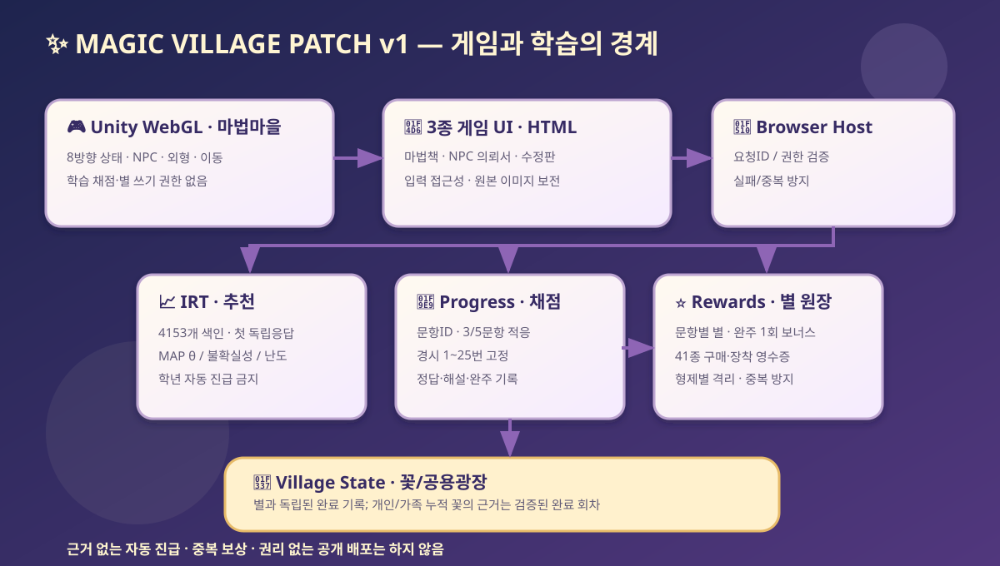

# 마법 마을 대규모 패치 — 상세 설계서 v1
**기준일**: 2026-10-10 · **개발 기준**: Web hub feat/village-major-patch-v1 + Unity feat/village-major-patch-v1  
**목표 릴리스**: v0.5.x 검증 빌드 · **운영 배포 기준**: 권리 확인·실기기 확인 후 별도 승인  
**원칙**: 재미있는 행동 경험 × 학습 측정 타당성 × 검증 가능한 별 원장 × 어린이 안전성.

## 1. 요구사항과 확인 가정
| 차원 | 사용자가 경험해야 하는 변화 | 기술적 구현 및 검수 게이트 |
|---|---|---|
| 방향/행동 | 걷는 방향과 행동에 따라 요정 움직임이 자연스럽게 변화 | 8 heading(전·후·좌·우·사선 4), Idle/Walk/Interact/Celebrate/Think/Cast 상태; 카메라 전면 빌보드와 logical transform 분리 |
| 상점 | 별 소비 → 보유 → 장착/해제 → 실제 마을 외형 변화 | 오직 JS `Rewards` 원장 쓰기, Unity는 확인된 `cosmetics` 스냅샷 읽기 |
| 경시대회 | 학년/시험 난이도 선택, 같은 시험 1→25 순차 완주 | 기존 27개 KMA 25문항 시험지 그대로, 결과/별 인증, 이어 풀기 |
| 적응학습 | 잘하는 것보다 살짝 어려운 개념을 새롭고 다양하게 만나기 | IRT 첫 독립답 추정 + 정확한 기존 문항 ID/검증 상태를 기반으로 게임/문항 선택 |
| 게임형 UI | 페이지 모달보다 세계 속 마법책·두루마리·수정판처럼 보기 | 3가지 테마, 펼친 책의 문제·선택지 분리, 타이포/프레임 통일, 모바일 접근성 |
| 마을 세계관 | NPC별 역할과 교류 의미를 행동으로 확인 | 고양이=상점, 다람쥐=적응학습, 부엉이=경시대회 |
| 복구·개인화 | 태희·세희가 각자 모은 별·착용 상태 보존 | 프로필 분리, 로컬 직렬화 복구, 중복 클릭/임의 보상 거절 |

### 명시적 가정
- **교사 검증되지 않은 정답에 대한 자동 평가는 판정 오류가 날 수 있음**: `machine_checked`는 전문가 재풀이 검증과 다릅니다.
- **IRT의 문항모수는 실증 보정되지 않음**: 현재 `a=1` 고정, `b` 편집 기준 추정, `c` 선택지 수 기반 추측 보정이며 1PL에 가깝습니다.
- **8방향 표현과 8개 독립 원화는 별개**: 기존 태희·세희 각 4개의 진짜 시점 그림을 사용합니다. 사선 4방향은 두 실제 시점 사이를 알파 합성한 전환 상태입니다. 독립 사선 원화 8개 추가 제작 전까지 **완전한 8시점 원화가 확보됐다고 주장하지 않습니다.**
- 선물 카탈로그 48종 중 **꾸미기 선물 41종**을 마을 별 상점에서 운영합니다. 보호자 승인형 가족 활동 7종은 기존 플랫폼에서만 신청하며 아동 UI 구매와 혼합하지 않습니다.
- 현재 마을의 수학·국어·영어 내부 퀴즈 약 4,153문항은 IRT 항목 색인에서 관리하나 외부 단위 정원 48문항은 다른 상태 저장소라 범위 밖입니다.

## 2. 프로덕트 루프
| 반복 단계 | 아이 행동 | 게임 피드백 | 증거 / 보상 |
|---|---|---|---|
| 탐험 | 요정 걷기, NPC 접근 | 안내 말풍선, 현재 목표 | 목적지·상호작용 확인 |
| 도전 선택 | 경시 시험지 25개 혹은 수정구슬 맞춤모험 | 목표/단계/예상 문제 형식 안내 | 학년 선택은 아이·보호자 소유 |
| 풀이 | 마법책 그림+선택지/조작 | 터치 선택, 접근성 안내, 원본 이미지 제공 | 답안, 문제 식별자, 반복 여부 |
| 학습 피드백 | 해설 확인, 나의 판단 설명 | 수정 구슬·완주/축하 모션 | 힌트·해설은 독립 역량 추정과 분리 |
| 보상/꾸미기 | 별 받기/상점 선택/장착 | 별빛, 동물, 하늘 색상, 배지 | 원장 검증 + 1회성 완주 보너스 |
| 재도전 | 다음 날/다음 시험 | 중단 지점부터 재개 | 누적 별·문항 첫 응답 추적 |

## 3. 화면 명세: 세 가지 동일 세계관 테마
| 화면 | 상호작용/시각 언어 | 규칙 |
|---|---|---|
| **마법책 (Tome)** | 25문항 벡수 도전, 책 펼침·왼쪽 원본 문제·오른쪽 조작, 금빛 책등·진행 별 | KMA 문제 그림은 잘라 변조하지 않고 원문 자체의 글씨를 판독할 수 있게 표시. 정답·해설은 풀이 뒤 표시 |
| **NPC 의뢰서 (Scroll)** | 토끼/우체국 이야기 퀘스트, 양피지 테두리·의뢰형 내러티브 | 사전 질문과 정답 반응을 짧고 명확하게 제공 |
| **별 수정판 (Crystal)** | IRT 기반 추천 게임, 개념별 조작 활동, 수정구슬·은은한 빛 | 기계적 능력 등급·자동 진급을 아이에게 제시하지 않음 |
| **별빛 상점 (Market)** | 선물 카드와 현재 보유 별, 구매/장착/해제 상태 | 저축·구매 기록 분리, 보유 전 미리 착용되지 않음 |
| **완주식 (Celebrate)** | 별·꽃·완주 메시지·돌아가기 | 올바른 완주만 보상, 재완주는 0별 추가 |

기본 상호작용은 웹 접근성 유지: 키보드 탭/포커스 트랩, TTS/낭독, 최소 44px 터치 타깃, `prefers-reduced-motion`, 태블릿/가로·세로 화면.

## 4. 캐릭터와 마을: 8방향 × 6상태 기술 설계
**방향 인덱스**: 0=정면, 1=우전방, 2=우측, 3=우후방, 4=후면, 5=좌후방, 6=좌측, 7=좌전방. 카메라 회전축 기준 `atan2(dot(direction,right),dot(direction,towardCamera))`를 45도 단위로 나눕니다. 짝수 방향은 독립 원화, 홀수 방향은 양쪽 독립 원화의 알파 합성.  
**상태**: Idle → Walk → Idle, 퀘스트 진입 시 Cast → Interact, 정답 Celebrate, 오답 Think. 상호작용 상태는 일정 시간 후 Idle로 복귀하며 학습 채점 상태와 혼동하지 않습니다.  
**논리-비주얼 분리**: 길찾기 이동 위치는 기존 `VillageWorld.BuildRoute` 그대로 사용, 게임 오브젝트를 실물처럼 회전시키지 않고 비주얼만 전환합니다.  
**장착 시각화**: `VillageOutfitView`는 분리된 `Rewards.wallet.look`에서 빛·동물 친구·마크·이름표를 렌더링합니다. `VillageWorld.ApplyCosmetics`는 하늘 색상을 바꿉니다. 기존 원본 PNG는 교체하지 않습니다.  
**예외**: 일부 친구(곰·여우·펭귄·고래 등)는 독립 원화가 아직 없어 임시 선물 기호로만 표시됩니다. 정확한 동물 외형을 잘못 표시하지 않습니다.

## 5. IRT 학습 엔진 v1
1. **측정**: 첫 독립 풀이(힌트/반복 제외)만 문항 증거에 반영, 태희·세희 분리. 문항 `id`, `skill`, `gradeBand`, `b`, `c`, `verification` 활용.
2. **추정**: `P(Y=1|theta,b,c)=c+(1-c)×sigmoid(theta-b)`, 정규사전분포 기반 MAP `theta`와 불확실성을 별도로 계산. **표본 없이 정밀 진단이 아님**.
3. **추천**: 과목·학년은 사용자 직접 지정. 같은 범위의 신규 문항, 추정 정답확률 약 74% 주변 문항, 최근 실수한 개념의 지원 필요도를 고려해 게임 후보를 정렬합니다. 실제 문항 번호/정답은 기존 퀴즈 엔진에 맡겨 일치성을 유지합니다.
4. **출제 운영 분리**: 시험지 모드의 25문항은 순서를 고정하고 IRT 정보는 완료 후 참고 분석으로만 사용. 적응형 모드의 일반 문제는 기존 `IRT.selectQuestions`가 3/5문항을 동적 선택합니다.
5. **형식 다양화**: 원본 문항의 정답 형식은 선택/숫자/짝짓기/순서/수조작을 그대로 보존하고, 화면 반응(서식/시각화/이펙트)을 바꿉니다. 자유롭게 문제를 새로 생성·정답 조작하는 일은 금지합니다.
6. **후속 고도화(게이트)**: a(변별도)·난도 b의 실측 추정을 위해 수백 명의 독립 첫 응답과 문항별 최소 사례수를 확보해야 함. 수집 목적·보호자 동의·아동 개인정보 영향 평가 선행.

## 6. 보상 무결성
- 문항 기본 별: 기존 `Progress.answerQuestion` 원장 그대로 유지.
- 완주 추가 별: 태희 160 / 세희 60 (한 학년 × 하나의 시험지당 **최초 1회**), 별도 `Rewards.bebsuChallengeStars`의 검증된 완료 기록에서 재계산.
- 상점: **검증된 별 잔액 → 기존 카탈로그 41종 중 선택 → JS 구매 기록 → 착용/해제 → Unity에 읽기 전용 알림**.
- 로그인 없는 로컬 프로토타입은 개발자 도구로 브라우저 기록 위조가 가능하므로 서버 수준의 부정행위 방지 시스템으로 표현할 수 없습니다.
- 연속정답 무한 별, 시간 체류시간 별, 오답 난이도 기반 현금성/희소성 보상은 이번 범위에서 제외합니다. 사고와 설명을 약화시키는 외적 동기 과잉 위험을 고려합니다.

## 7. 아키텍처


```
Unity WebGL (이동·월드·행동·NPC·연출)
 └─ BrowserBridge (상태조회·문항·아이템 명령, 요청ID)
    ├─ Quiz Host: catalog + 25문항 고정 시험지 + UI theme
    ├─ IRT: item bank → 최초 독립 응답 → 능력 사후추정 → 게임 추천
    ├─ Progress: 채점·완료 기록·선택한 학습자
    ├─ Rewards: 별·구매·장착의 유일한 권한
    └─ Village State: 완주 꽃·가족광장 (별과 별개)
```

## 8. 테스트/배포 승인 기준
| 테스트 묶음 | 정량·정성 수용 기준 |
|---|---|
| 문항 | 27개 KMA 시험지 × 25문항 순번 정확, 원본 이미지 존재·검증 상태 분리 |
| 적응 | 올바른 과목·학년 제한, 불확실성 표시, 전과목 IRT 등록, 자동 진급 금지 |
| 구매 | 0별 구매 불가, 중복 구매 0별 추가, 미보유 장착 불가, 해제·복원 유지, 형제 지갑 분리 |
| Unity | 8개 방향 상태 전환, 6행동 상태, 카메라 빌보드 유지, 돌출·과다 생성/재접속 확인 |
| 시각 | 마법책/의뢰서/수정판/상점/완주 화면, 320·390·768·1280px 텍스트 가독성 |
| 상호작용 | NPC 접근, 별빛/동물/마크/이름표 장착 즉시 화면 반영, 중복 전달에도 하나의 결과 |
| 개인정보 | 각자 로컬 기록, 보호자 앱 별도, 비밀번호·학교 정보 공개 저장소 없음 |
| 권리 | KMA 원본 `private_reference_only` 확인: 권리자 허락 없이는 공개 배포/공용 캐시 금지 |

## 9. 우선순위 및 미완료 작업
- P0: 고정 경시대회 25문항 보존, 세부 게임 UI, 적응형 추천, 상점 원장 연동, 8방향 상태 전환, 기본 QA.
- P1: **완전히 다른 각도에서 새로 그린 독립 사선 원화 × 2인**, 캐릭터 고유 애니메이션 시트, 모든 8종 동물 원화, 아이템 착용 위치 보정.
- P2: 문제 내용 검수(적어도 학년별 25문항 대표 표본), 터치 드래그 퍼즐·공간 속 문제 풀이, 실측 IRT 보정, 음향·성과평가.
- **실기기 iPhone/iPad/Android 성능과 장기 학습효과**는 자동 브라우저 테스트로 입증할 수 없으므로 보호자·아동 실제 사용 검증 필요.

## 10. 사용자 검토 질문
1. 태희의 25문항 완주 160별은 **완주 자체** 중심으로 둘까요, 아니면 설명하기/다시 풀기 등 학습 행동을 포함해 일부 분산할까요?
2. 수정구슬 모드의 목표 예상 정답확률 74%가 태희·세희 각각에게 적정한 좌절/성공 균형인지 실제 관찰이 필요합니다.
3. 시험지 원본을 비공개 가족용으로만 사용하면서도 공개 마법마을을 운영할 경우, 원본 그림을 보호자 인증 뒤 제공할지 콘텐츠를 자체 제작형으로 대체할지 권리 검토 후 결정해야 합니다.
