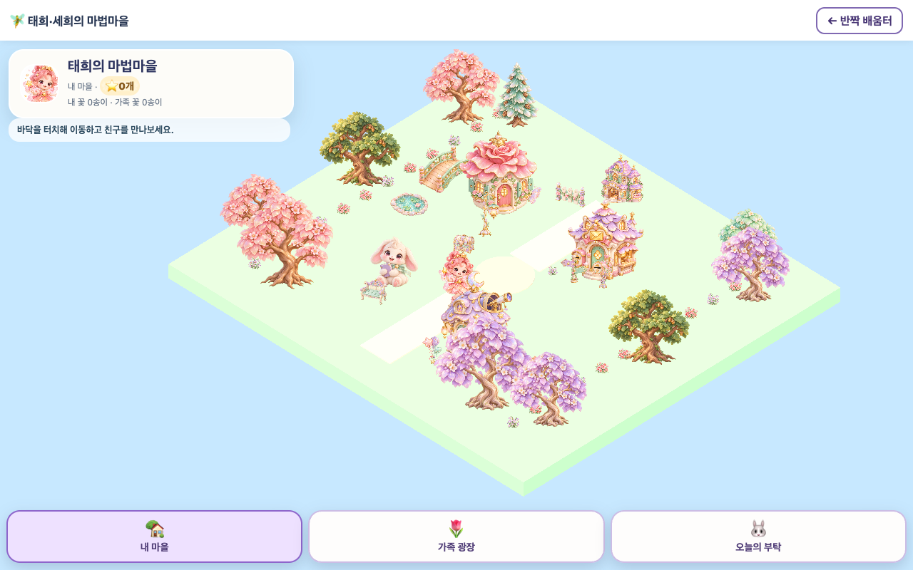
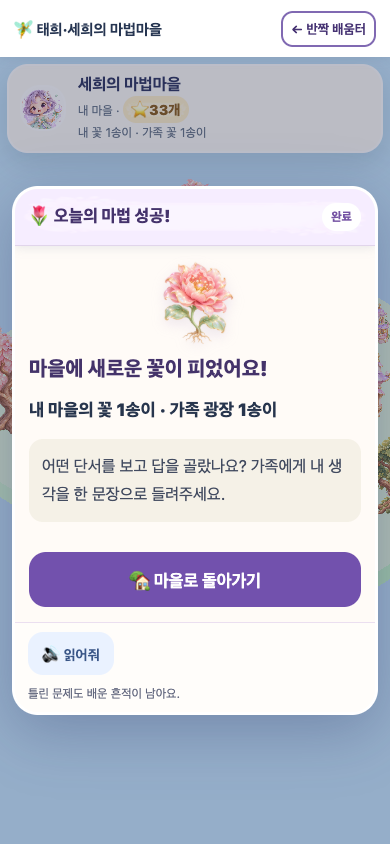

# 태희·세희 마법마을 품질 개선 v2
2026-10-10 · Unity WebGL 0.2.0 · 개발 브랜치 `feat/magic-village-quality-v2`

원화의 색·재질·요정 정체성을 따라 독립 RGBA 아트 62종을 새로 제작하고, 이동·학습·보상·저장 흐름을 함께 보완했다. 기존 1차 아트와 요정 참조 원본은 보존했다. 현재는 3D 지형 위의 2.5D 일러스트 스프라이트이며, 리깅된 3D 모델은 아니다.

## 실제 변경
| 영역 | 적용 결과 |
|---|---|
| 아트 | 캐릭터2·월드43·보상14·UI3. 대부분1254×1254, UI최대2172×724. 원본PNG87.11MiB, 생성 후 픽셀 편집·크롭·리사이즈 없이 SHA-256 동일하게 통합 |
| Unity | 독립 프리팹62개, 유효한 MonoScript GUID, 투명 실루엣 발 위치·크기 보정, 카메라 정면 빌보드, 깊이 정렬. Unity GPU텍스처는 주요 에셋1024/소품512 한도로 처리 |
| 이동 | 건물·연못을 피하는 경로, 실제 그림 자식의 클릭 콜라이더, UI를 누를 때 뒤쪽 지형으로 이동하지 않도록 입력 분리 |
| 모바일 시야 | 고정 세로 줌9.2를 화면 비율 기반 시야로 교체. 학습·별 계산에 영향 없이 주요 건물과 친구를 볼 수 있는 가로 범위 확보 |
| 운영·보상 | 채점/NEXT 중복·지연 응답 차단, 다른 아이로 전환한 이전 미션 차단, 쉬기 후 채점된 문항은 해설 화면으로 재개. 저장 실패 구매 롤백, 최신 지갑과 구매 이력 검증 |
| 재미 | 별·새싹·꽃 원화 보상 표시, 개인 정원과 가족 광장에 고유 완주 꽃 반영. 기존48개 선물·5종 착용 슬롯 유지 |
| 학습 | 실제 수량·0개 그림 표시, 비어 있는 연결 답 제출 차단, 답을 드러내지 않는 힌트와 해설·음성 읽기. 태희5/세희3문항, 세 이야기 후 쉬기 안내, 완료 후 이유 말하기 |
| 판단 | 별과 능력 추정 분리. 첫 응답이 독립적이었던 서로 다른 문항만 IRT 근거로 사용. 새 근거가 부족하면 같은 과목의 새 모험 안내. 저장 성장 단계와 추천 출제 수준 구분 |

동시 진행된 IRT 작업의 소스를 덮어쓰지 않고 통합 스냅샷에 보존했다. 문항 색인4153개와 자료 이미지7360개에 대한 기존 검증이 통과한다. 색인의 통계 모수는 콘텐츠에 근거한 초기 가정으로, 실증 보정된 검사나 임상적 학습 효과를 뜻하지 않는다.

## 확인한 범위
- 원본62개와 Unity현재62개 PNG의 SHA-256 일치, 이전62개 백업 SHA 일치.
- 원본 에셋 시각 검토62개: 누락·객체 잘림·불필요 배경·워터마크·명확한 스타일 붕괴 없음. 극미세 낮은 알파 픽셀은 native 그대로 보존.
- 프리팹62개에 Missing Script 없음, 비UI59개 foot/configured 직렬화 확인.
- 실제 C# 경로360개·선분557개·선분당100개 샘플 검사 통과.
- 최종 Unity BuildWeb 종료0, 캐시 버전20261010c. 생성된 4개 빌드 파일과 호스트 복사본 SHA 동일.
- 분리된 통합 개발 체크아웃에서 `npm run check` 전체 통과. [실행 기록](quality-v2-checks.json).
- DOM 모의 화면390×844 /844×390 /1024×768 /1440×900의 36검사 통과, pageErrors0.
- 최종 카메라 빌드 WebGL 10/10 통과: 태희5문항→53별, 세희3문항→33별. 각 개인·가족 꽃1개, 다른아이0개. 광장 이동·새로고침 기록 보존. 실제 토끼 클릭도 정상. [상세 QA](VILLAGE_QUALITY_QA_20261010.md) / [최종 JSON](quality-v2-webgl.json).
- console error·Unity 예외0건. 소프트웨어 렌더러 경고와 종료/취소 요청은 원문 기록. [console 관측](quality-v2-console.json).
- 브라우저 실행 뒤 START 로딩 중 아이 변경을 막는 호스트3줄 보완을 추가하고 deferred fetch 회귀로 양쪽 진도·저장 무변경을 검증했다. 실행 당시 브라우저 소스 해시와 이 후속 Node검증 해시를 구분한다. [회귀 결과](quality-v2-start-race.json).

학습 테스트는 격리된 가상 브라우저 저장소를 사용한다. 실제 아이 기록을 변경하지 않는다.

## 현재·이전·출력의 정확한 파일 위치
원본 작업 공간:
- Unity: `/Users/01chungee10/Github/sparkle-fairy-village`
- 학습 호스트: `/Users/01chungee10/Github/sparkle-learning-hub`
- 검증된 통합 개발 체크아웃: `/Users/01chungee10/Github/sparkle-learning-hub-quality-v2`

Unity의 [전체 파일 경로·SHA 대장](https://github.com/01chungee10snu/sparkle-fairy-village/blob/feat/magic-village-quality-v2/Assets/Art/Generated/native-v2-file-manifest.json)은 현재 PNG·프리팹·스크립트·이전 PNG·원본 참조·빌드 출력의 개별 절대 경로를 기록한다. 호스트의 [통합 스냅샷 대장](quality-v2-snapshot.json)은 읽어 온 원본 파일과 현재 통합 파일의 개별 절대 경로와 해시를 기록한다. [보상 검증](REWARD_INTEGRITY_20261010.md)과 [브라우저 검증](VILLAGE_QUALITY_QA_20261010.md)에는 각 검토 소스·이전 백업·검증 이미지의 정확한 경로가 있다.

```text
sparkle-fairy-village/
  Assets/Resources/Sprites/{Characters,World,Rewards,UI}/
  Assets/Resources/art-layout.json
  Assets/Prefabs/2_5D/{Characters,World,Rewards,UI}/
  Assets/Scripts/{VillageRuntime,VillageWorld,VillageArt,VillageBridge,VillageBillboard,VillageHotspot}.cs
  Assets/Editor/{VillageEditorBuild,VillageSpriteImporter,VillagePrefabGenerator}.cs
  Assets/Art/Generated/{asset-catalog,native-v2-*}.json
  Assets/Art/Previous/20261010-first-pass/
  Assets/Art/Source/Characters/fairy-companions_original.webp
  Scripts/Art/{import_native_art_v2,check_magic_art}.py
  Builds/WebGL/Build/WebGL.*
sparkle-learning-hub-quality-v2/
  village/{index.html,village-bridge.js,village-ui.js,village-ui.css,village-state.js}
  village/assets/{ui_mission_panel,ui_star_pill,ui_button,star_yellow,sprout,bloom}.png
  village/Build/WebGL.*
  village/preview/quality-v2-*.png
  platform/{progress,irt,growth,rewards}.js
  scripts/{check-reward-integrity,check-village-quality,village-browser-qa}.mjs
  docs/{QUALITY_V2_20261010,VILLAGE_QUALITY_QA_20261010,REWARD_INTEGRITY_20261010}.md
  docs/quality-v2-*.json
```

## 실제 화면



## 남아 있는 검증 한계
실제 iPhone Safari·Android 기기의 프레임·발열·터치 성능은 확인하지 않았다. Chrome headless의 모의 화면과 소프트웨어 WebGL 렌더러로 검증했다. 실제 아동의 이해도·전이·유지 효과는 별도 관찰이 필요하다. 같은 문항 반복 성공은 학습 연습으로 인정하되 독립 IRT 근거를 늘리지 않는다. 매우 큰 새 문항 은행에서는 기존 오답 복습의 빈도를 따로 관찰할 필요가 있다. 로컬 저장소는 서버 트랜잭션과 같은 다중 탭 동시 쓰기 보장을 제공하지 않는다.

공개 main 서비스는 변경하지 않았다. 이 결과는 개발 브랜치의 실제 소스·아트·재빌드와 검증 기록이다.
